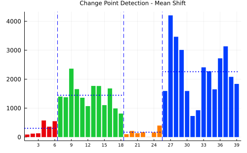

# ChangePointMean

Detect change point of mean shift via cusum randomization.

[](https://DaymondLing.github.io/ChangePointMean.jl/stable)
[](https://DaymondLing.github.io/ChangePointMean.jl/dev)
[](https://github.com/DaymondLing/ChangePointMean.jl/actions)
[](https://codecov.io/gh/DaymondLing/ChangePointMean.jl)



## Installation.

This package can be installed its URL:

```
] add https://github.com/DaymondLing/ChangePointMean.jl
```

## Purpose

If you are looking for general purpose change point detection, e.g.,
change in mean or variance or slope, this package is not it.
[Changepoints](https://github.com/STOR-i/Changepoints.jl) is 
probably what you are looking for.

This is a simple, useful, efficient package for detecting mean shift
in a time series via cusum randomization test. 
It is non-parametric in the sense that there are no distribution assumptions.
References can be found here:

- https://variation.com/wp-content/uploads/change-point-analyzer/change-point-analysis-a-powerful-new-tool-for-detecting-changes.pdf

- https://support.sas.com/resources/papers/proceedings17/1489-2017.pdf

## Current capabilities

There are two base functions for finding a change point:

- `mcppv` examines a vector and calculates the p-value of existence of a mean
change point via cusum randomization test of the centered series.

- `mcptime` estimates the location of the change point by looking for the
point with minimum overall sum of squares.

These two functions can be useful when manually checking for
the existence of a change point and, if yes, its location.

For easier analysis of a time series, you can use `mcpoint` which uses
`mcppv` and `mcptime`:

- `mcpoint` returns the index of a change point (beginning of change)
if there is one, 0 otherwise.

Building off of `mcpoint`, you can use these two higher level functions:

- `mcplast` returns the index of the most recent change point 
by repeatedly calling `mcpoint` on the more recent segment until 
no more change can be found.
If there are no change points, 0 is returned.

- `mcpall` returns a vector of all change points, length of vector is
the number of change points detected via recursive partitioning.
This function recursively calls `mcpoint` on all segments until
no changes can be detected.
If there are no changes, an empty vector is returned.

And,

- `mcplot` plots the time series broken into segments to aid visualization.
