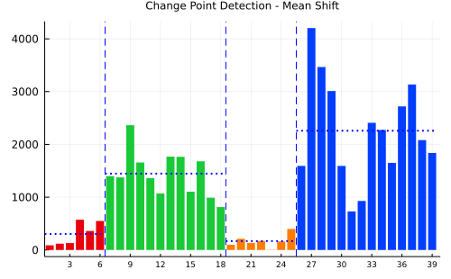

```@meta
CurrentModule = ChangePointMean
```

# ChangePointMean.jl

Documentation for [ChangePointMean](https://github.com/DaymondLing/ChangePointMean.jl).

```@raw html

```

## Installation

This package is installable via its URL:

```
] add https://github.com/DaymondLing/ChangePointMean.jl
```

## Index

```@index
```

## autodocs

```@autodocs
Modules = [ChangePointMean]
```
